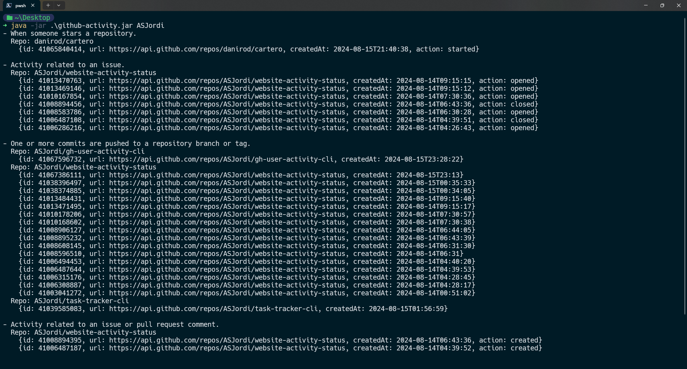
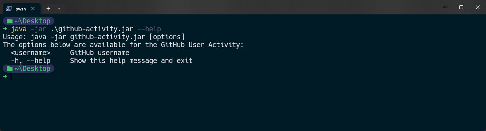

<div align="center">
  <h1 align="center"><a href="https://github.com/ASJordi/gh-user-activity-cli">GitHub User Activity CLI</a></h1>

  <p align="center">CLI app to fetch the recent activity of a GitHub user and display it in the terminal.</p>
</div>

## About :computer:

Simple command line interface (CLI) to fetch the recent activity of a GitHub user and display it in the terminal. The app uses the GitHub API to fetch the user's activity and display it in the terminal.

 <br>


## Features :sparkles:

- Fetch the recent activity of a GitHub user
- Display the activity in the terminal

```bash
# Fetch the recent activity of the specified GitHub user using the GitHub API.
# https://api.github.com/users/<username>/events
# Example: https://api.github.com/users/ASJordi/events 
```

## Technologies :gear:

- Java 21
- [GSON](https://github.com/google/gson)

## Installation :floppy_disk:

1. Clone the repository
2. Open the project in your favorite IDE
3. Run the project
4. Or build the project with Maven and run the generated jar file

```bash
mvn clean install
```

## Usage :hammer_and_wrench:

```bash
Usage: java -jar github-activity.jar [options]
The options below are available for the GitHub User Activity:
  <username>     GitHub username
  -h, --help     Show this help message and exit
```

### Examples :bulb:

```bash
java -jar github-activity.jar ASJordi

# Output:

# Event type (Description)
# Repository name
# Event[id, repoUrl, createdAt, action]
# ...
# Event type (Description)
# Repository name
# Event[id, repoUrl, createdAt, action]
# ...
```

## License :page_facing_up:

Distributed under the MIT License. See `LICENSE` for more information.

## Contact :email:

Jordi Ayala - [@ASJordi](https://twitter.com/ASJordi)

Project Link: [https://github.com/ASJordi/gh-user-activity-cli](https://github.com/ASJordi/gh-user-activity-cli)

Reference: [https://roadmap.sh/projects/github-user-activity](https://roadmap.sh/projects/github-user-activity)
